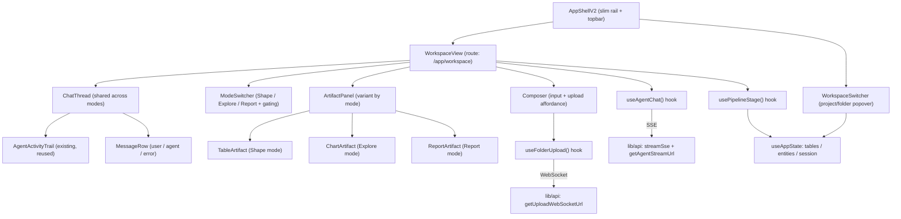
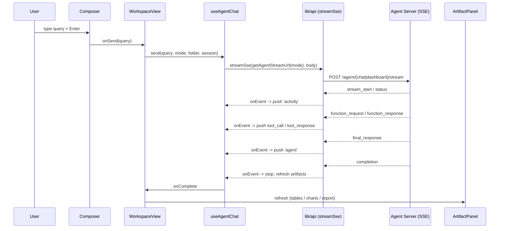
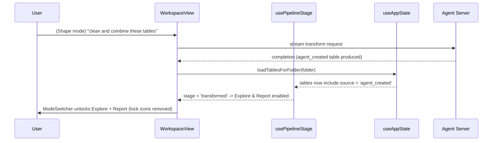
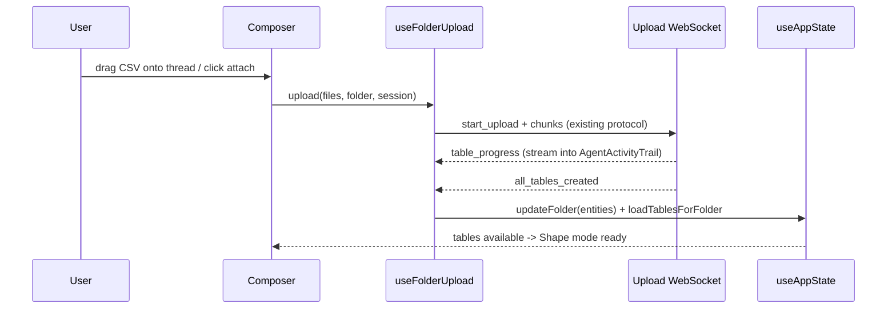

# Design Document: Chat-Workspace Redesign

## Overview

This is a **UI-only** redesign that collapses EventHorizon's four legacy pages (Upload, Transform, Dashboard, Report) plus the hierarchy/upload pages into a single, minimalist, chat-first workspace styled like Claude Code / OpenAI Codex. One conversation is the primary surface; a right-side **artifact panel** changes shape depending on which **mode** the user is in. A **mode switcher** sits above the chat with three stepwise-gated modes - proposed renames **Shape · Explore · Report** (formerly Transform · Dashboard · Report) - that unlock as the pipeline `Upload → Transform → Dashboard → Report` progresses.

The chat thread, streaming schema, and the existing `AgentActivityTrail` are **identical across all three modes** (same event schema, same monochrome palette). Only the input affordances, the agent stream endpoint, and the artifact-panel variant differ per mode. Folder hierarchy and uploads do **not** get dedicated full pages anymore: hierarchy lives in a slim left **workspace switcher** (popover/command palette) and an empty-state onboarding flow, while upload becomes an affordance **inside the conversation** (a composer attach button + drag-and-drop onto the thread) backed by the existing WebSocket upload.

The backend is complete. This design consumes the existing agent SSE (`/agent/chat/stream`, `/agent/dashboard/stream`), the folder/project/session/table REST APIs, and the upload WebSocket - all already in `lib/api.ts`. No backend changes.

## Architecture



**Key architectural moves:**

- The current `Workspace.tsx` is decomposed. Its inline left rail, header, empty state, composer, message rows, and tables panel become dedicated components under `components/workspace/`. The page file becomes a thin orchestrator (`WorkspaceView`).
- A new **mode** dimension (`'shape' | 'explore' | 'report'`) drives: which stream endpoint to call, which artifact panel to render, and the composer's quick-action chips.
- **Pipeline stage** is *derived*, not stored: it is computed from `appState.tables` (uploaded vs `agent_created` source) + folder entities. This gates the mode switcher with zero new backend state.
- The legacy `Projects` and `Upload` pages are retained as fallback routes but are no longer primary navigation; their capabilities are surfaced inside the chat-first shell.

## Sequence Diagrams

### Main flow: send a message in the active mode



### Stepwise gating: transform unlocks downstream modes



### Upload folded into the conversation



## Screen Anatomy & Responsive Layout

### Desktop (>= 1024px)

```
┌──────┬───────────────────────────────────────────────┬──────────────────────┐
│ Rail │  Topbar: WorkspaceSwitcher ▸ @folder · model   │                      │
│ 56px │───────────────────────────────────────────────│   ArtifactPanel       │
│      │  ModeSwitcher:  [ Shape ] [ Explore ] [ Report]│   (variant by mode)   │
│ ◇ new│───────────────────────────────────────────────│                       │
│ ⌂ home│                                               │  Shape  → TableArtifact│
│ ▤ data│   ChatThread (max-w 820px, centered)          │  Explore→ ChartArtifact│
│ ↻ hist│     • user bubble (right)                     │  Report → ReportArtifact│
│ ⚙ set │     • AgentActivityTrail (collapsible)        │                       │
│      │     • agent message (left)                     │  toggle: PanelRight   │
│      │───────────────────────────────────────────────│                       │
│ ? help│  Composer: [@folder] [ attach ] textarea [▸]  │                       │
└──────┴───────────────────────────────────────────────┴──────────────────────┘
```

- **Left rail**: 56px icon rail (collapsible to labels). Hosts New chat, Home (workspace switcher), Data, History, Settings, Help. Replaces the old 224-260px sidebar with a Codex-style slim rail.
- **Center column**: ModeSwitcher pinned at top, scrolling ChatThread (centered, `max-w-[820px]`), Composer pinned at bottom.
- **Right ArtifactPanel**: static (in-flow) at `>=1024px`, width `440px`, collapsible via the topbar toggle. Variant is chosen by current mode.

### Tablet (640-1023px)

- Left rail collapses to a hamburger that opens the rail as an overlay.
- ArtifactPanel becomes an **overlay drawer** (`fixed inset-y-0 right-0`, `w-[420px]`) instead of in-flow, toggled from the topbar.
- ChatThread takes the full width when the panel is closed.

### Mobile (< 640px)

- Single column. Rail → bottom-sheet menu via hamburger.
- ModeSwitcher becomes a full-width segmented control that wraps; gated modes show a lock glyph.
- ArtifactPanel is a full-screen overlay (`w-full`) that slides up; closing returns to the thread.
- Composer is sticky to the bottom; the attach/upload control collapses into a single `+` menu.

## Section Names (FINAL - per stakeholder brief)

Four modes (Upload is now a first-class mode, not just a composer affordance):

| Legacy | Final name | Stream surface |
|--------|-----------|----------------|
| Upload | **Sources** | upload WebSocket (no chat stream) |
| Transform | **Prepare** | `/agent/chat/stream` |
| Dashboard | **Visualize** | `/agent/dashboard/stream` |
| Report | **Publish** | `/report/chat/stream` (or `/agent/chat/stream` with report intent) |

Switcher label set: **Sources · Prepare · Visualize · Publish**. NOTE: this supersedes the earlier 3-mode `Shape · Explore · Report` proposal; `WorkspaceMode = 'sources' | 'prepare' | 'visualize' | 'publish'` and the gating/endpoint/artifact mappings below are updated accordingly in the requirements (see requirements.md R3, R6-R9).

## Components and Interfaces

### Component tree

```
AppShellV2
└─ WorkspaceView                      (route: /app/workspace)
   ├─ WorkspaceTopbar
   │  ├─ WorkspaceSwitcher            (project ▸ folder popover / command palette)
   │  └─ ArtifactToggle               (open/close right panel)
   ├─ ModeSwitcher                    (Shape | Explore | Report + gating)
   ├─ ChatThread
   │  ├─ EmptyState                   (onboarding: pick/create folder, upload, examples)
   │  ├─ MessageRow                   (user / agent / error)
   │  └─ AgentActivityTrail           (EXISTING - reused unchanged)
   ├─ Composer
   │  ├─ FolderChip
   │  ├─ UploadAffordance             (attach button + drag-drop target)
   │  └─ ModeQuickActions            (mode-specific suggestion chips)
   └─ ArtifactPanel                   (chooses one variant by mode)
      ├─ TableArtifact                (Shape)
      ├─ ChartArtifact                (Explore)
      └─ ReportArtifact               (Report)
```

### Component: WorkspaceView

**Purpose**: Thin orchestrator. Owns chat state, current mode, panel open/closed; wires hooks to children.

**Interface**:
```typescript
type WorkspaceMode = 'shape' | 'explore' | 'report';

interface WorkspaceViewProps {
  // No props; reads context (useAppState, useAuth) and URL (?folderId, ?mode).
}
```

**Responsibilities**:
- Resolve folder from `?folderId` via `appState.loadFolderContext`.
- Persist/restore `mode` in the URL (`?mode=`) and guard it against the gating rule.
- Provide `send`, `stop`, `newChat` to children via `useAgentChat`.
- Refresh the correct artifact set on stream `completion`.

### Component: ModeSwitcher

**Purpose**: Segmented control to switch modes, with stepwise gating.

**Interface**:
```typescript
interface ModeDescriptor {
  id: WorkspaceMode;
  label: string;          // 'Shape' | 'Explore' | 'Report'
  enabled: boolean;       // derived from pipeline stage
  lockedReason?: string;  // tooltip when disabled
}

interface ModeSwitcherProps {
  modes: ModeDescriptor[];
  active: WorkspaceMode;
  onChange: (mode: WorkspaceMode) => void;  // no-op when target disabled
}
```

**Responsibilities**:
- Render three pills; disabled pills show a lock icon + tooltip (`lockedReason`).
- Never emit `onChange` for a disabled mode.

### Component: WorkspaceSwitcher

**Purpose**: Replaces the Projects page as the primary hierarchy surface. A topbar popover/command palette to switch project → folder, create either, and trigger onboarding.

**Interface**:
```typescript
interface WorkspaceSwitcherProps {
  projects: Project[];
  folders: Folder[];
  selectedProject: Project | null;
  selectedFolder: Folder | null;
  onSelectFolder: (folderId: string) => void;
  onCreateProject: (name: string, description: string) => Promise<Project | null>;
  onCreateFolder: (projectId: string, name: string, description: string) => Promise<Folder | null>;
}
```

**Responsibilities**:
- Search/filter projects and folders.
- Inline create (reuses `appState.createProject` / `createFolder`).
- On folder pick, call `onSelectFolder` → `loadFolderContext`.

### Component: ArtifactPanel

**Purpose**: Container that renders exactly one artifact variant for the active mode.

**Interface**:
```typescript
interface ArtifactPanelProps {
  mode: WorkspaceMode;
  open: boolean;
  onClose: () => void;
  // data sources pulled from context inside each variant
}
```

**Responsibilities**:
- Render `TableArtifact` (shape), `ChartArtifact` (explore), or `ReportArtifact` (report).
- Manage responsive behavior (in-flow on desktop, overlay drawer below `lg`).

### Component: Composer (with upload affordance)

**Purpose**: Shared input across modes plus the in-conversation upload entry point.

**Interface**:
```typescript
interface ComposerProps {
  value: string;
  mode: WorkspaceMode;
  disabled: boolean;            // true when no folder selected
  isGenerating: boolean;
  folderName?: string;
  quickActions: string[];       // mode-specific suggestion chips
  onChange: (v: string) => void;
  onSend: () => void;
  onStop: () => void;
  onFilesSelected: (files: File[]) => void;  // attach button + drag-drop
}
```

## Data Models

### Frontend view models (new)

```typescript
type WorkspaceMode = 'shape' | 'explore' | 'report';

type PipelineStage = 'empty' | 'uploaded' | 'transformed';
// empty       : no tables in folder            -> only Shape enabled (to upload + transform)
// uploaded    : >=1 uploaded table, no agent table -> Shape enabled; Explore/Report locked
// transformed : >=1 agent_created table         -> all modes enabled

interface PipelineState {
  stage: PipelineStage;
  hasUploadedTables: boolean;
  hasTransformTable: boolean;
  enabledModes: Record<WorkspaceMode, boolean>;
}

interface ArtifactState {
  tables: DataTable[];          // existing type (Shape)
  charts: ChartWidget[];        // existing type (Explore)
  reports: GeneratedReport[];   // existing type (Report)
}
```

**Validation / derivation rules**:
- `hasUploadedTables = tables.some(t => t.source === 'uploaded')`
- `hasTransformTable = tables.some(t => t.source === 'agent_created')`
- `stage = hasTransformTable ? 'transformed' : hasUploadedTables ? 'uploaded' : 'empty'`
- `enabledModes.shape = true` always (so users can upload/transform).
- `enabledModes.explore = enabledModes.report = hasTransformTable`.

### Reused streaming schema (unchanged)

```typescript
// Existing ChatMessage / MessageType from types/index.ts are reused verbatim.
// SSE event -> ChatMessage mapping is identical in all three modes:
//   stream_start | status          -> { type: 'activity' }
//   tool_call | function_request   -> { type: 'tool_call' }
//   tool_response | function_response -> { type: 'tool_response' }
//   final_response                 -> { type: 'agent' }
//   completion                     -> stop + refresh artifacts
//   error                          -> { type: 'error' }
```

## Algorithmic Pseudocode

### Pipeline stage derivation

```pascal
ALGORITHM derivePipelineState(tables)
INPUT: tables : list of DataTable
OUTPUT: state : PipelineState

BEGIN
  hasUploaded  ← EXISTS t IN tables WHERE t.source = 'uploaded'
  hasTransform ← EXISTS t IN tables WHERE t.source = 'agent_created'

  IF hasTransform THEN
    stage ← 'transformed'
  ELSE IF hasUploaded THEN
    stage ← 'uploaded'
  ELSE
    stage ← 'empty'
  END IF

  enabled.shape   ← true
  enabled.explore ← hasTransform
  enabled.report  ← hasTransform

  RETURN { stage, hasUploaded, hasTransform, enabledModes: enabled }
END
```

**Preconditions**: `tables` is the current folder's table list (may be empty).
**Postconditions**: `shape` always enabled; `explore`/`report` enabled iff a transform table exists. Pure function, no side effects.

### Mode guard on switch

```pascal
ALGORITHM requestModeChange(target, state, currentMode)
INPUT: target : WorkspaceMode, state : PipelineState, currentMode : WorkspaceMode
OUTPUT: nextMode : WorkspaceMode

BEGIN
  IF state.enabledModes[target] = true THEN
    RETURN target
  ELSE
    RETURN currentMode          // ignore clicks on locked modes
  END IF
END
```

**Preconditions**: `state` derived from current tables.
**Postconditions**: Never returns a disabled mode; returns `currentMode` unchanged when blocked.

### Stream endpoint selection (mode -> existing API)

```pascal
ALGORITHM streamUrlForMode(mode)
INPUT: mode : WorkspaceMode
OUTPUT: url : string

BEGIN
  IF mode = 'explore' THEN
    RETURN getAgentStreamUrl('dashboard')   // /agent/dashboard/stream
  ELSE
    RETURN getAgentStreamUrl('transform')   // /agent/chat/stream  (Shape & Report)
  END IF
END
```

**Preconditions**: `mode` is a valid `WorkspaceMode`.
**Postconditions**: Returns an existing agent endpoint; no new endpoints introduced.

### Send + stream handling (shared across modes)

```pascal
ALGORITHM handleSend(query, mode, folder, session, user)
INPUT: query : string, mode : WorkspaceMode, folder : Folder,
       session : Session, user : User
OUTPUT: appends ChatMessages; refreshes artifacts on completion

BEGIN
  ASSERT query ≠ "" AND folder ≠ NULL AND user ≠ NULL
  push({ type: 'user', content: query })
  isGenerating ← true
  hasFinal ← false
  ensure session exists

  streamSse(streamUrlForMode(mode), buildBody(query, mode, folder, session, user),
    onEvent(event):
      t ← event.type OR event.status
      CASE t OF
        'stream_start','status'              : push activity(event.message)
        'tool_call','function_request'       : push tool_call(event.tool_name)
        'tool_response','function_response'  : push tool_response(event.tool_name)
        'final_response'                     : hasFinal ← true; push agent(event.text)
        'completion':
            IF event.final_output AND NOT hasFinal THEN push agent(event.final_output)
            isGenerating ← false
            refreshArtifacts(mode, folder)   // see below
        'error'                              : push error(event.message); isGenerating ← false
      END CASE
    onError(e): push error(e.message); isGenerating ← false
  )
END
```

**Loop invariant** (over streamed events): the rendered thread always reflects every event received so far in arrival order; at most one `agent` final message is appended per request (guarded by `hasFinal`).

### Refresh artifacts after completion

```pascal
ALGORITHM refreshArtifacts(mode, folder)
BEGIN
  // Tables always refreshed so pipeline gating updates (transform may have run).
  appState.loadTablesForFolder(folder)

  CASE mode OF
    'shape'   : (table list refresh above is sufficient)
    'explore' : charts are appended from chart_result events / dashboard activation
    'report'  : report artifacts refreshed from completion payload / folder artifacts
  END CASE
END
```

**Postconditions**: After any completion, `tables` are reloaded so `derivePipelineState` re-runs and the ModeSwitcher gating updates without a page reload.

## Key Functions with Formal Specifications

### usePipelineStage()

```typescript
function usePipelineStage(tables: DataTable[]): PipelineState
```
**Preconditions**: `tables` from `useAppState()` (possibly empty).
**Postconditions**: Returns memoized `PipelineState`; recomputes only when `tables` identity changes. Pure derivation, no side effects.
**Loop invariants**: N/A.

### useAgentChat()

```typescript
interface UseAgentChat {
  messages: ChatMessage[];
  isGenerating: boolean;
  send: (query: string, mode: WorkspaceMode) => Promise<void>;
  stop: () => void;
  reset: () => void;
}
function useAgentChat(ctx: {
  folder: Folder | null;
  session: Session | null;
  user: User | null;
  ensureSession: () => Promise<Session | null>;
  onCompletion: (mode: WorkspaceMode) => void;
}): UseAgentChat
```
**Preconditions**: `send` only proceeds when `folder`, `user` present and not already generating.
**Postconditions**: Streams via `streamSse`; appends messages per the schema mapping; calls `onCompletion(mode)` exactly once per successful stream; `stop()` aborts the in-flight `AbortController`.
**Loop invariants**: see `handleSend`.

### useFolderUpload()

```typescript
interface UseFolderUpload {
  upload: (files: File[]) => Promise<void>;
  progress: number;
  stage: 'idle' | 'uploading' | 'creating' | 'complete';
  error: string | null;
}
function useFolderUpload(ctx: {
  folder: Folder | null;
  user: User | null;
  ensureSession: () => Promise<Session | null>;
  onTablesCreated: (folder: Folder) => void;
}): UseFolderUpload
```
**Preconditions**: `folder` and `user` present; files are `.csv/.xls/.xlsx`.
**Postconditions**: Reuses the existing WebSocket protocol (`getUploadWebSocketUrl`, chunked `start_upload`/`metadata`/`data`/`process_files`); on `all_tables_created`, merges `entities` via `updateFolder` and calls `onTablesCreated` → triggers `loadTablesForFolder`, which can flip pipeline stage to `transformed` once an agent table exists.
**Loop invariants** (chunk loop): bytes sent monotonically increase; `progress` ∈ [0,100] and never decreases within a single file's transfer.

## Example Usage

```typescript
// WorkspaceView wiring (illustrative)
function WorkspaceView() {
  const appState = useAppState();
  const { user } = useAuth();
  const { tables, selectedFolder, activeSession } = appState;

  const [mode, setMode] = useState<WorkspaceMode>('shape');
  const [panelOpen, setPanelOpen] = useState(true);

  const pipeline = usePipelineStage(tables);

  const chat = useAgentChat({
    folder: selectedFolder,
    session: activeSession,
    user,
    ensureSession: appState.ensureSession,
    onCompletion: () => { if (selectedFolder) void appState.loadTablesForFolder(selectedFolder); },
  });

  const changeMode = (target: WorkspaceMode) =>
    setMode(prev => (pipeline.enabledModes[target] ? target : prev));

  const modes: ModeDescriptor[] = [
    { id: 'shape',   label: 'Shape',   enabled: pipeline.enabledModes.shape },
    { id: 'explore', label: 'Explore', enabled: pipeline.enabledModes.explore,
      lockedReason: 'Create a transform table first' },
    { id: 'report',  label: 'Report',  enabled: pipeline.enabledModes.report,
      lockedReason: 'Create a transform table first' },
  ];

  return (
    <div className="flex h-[calc(100vh-3.5rem)]">
      <SlimRail />
      <main className="flex min-w-0 flex-1 flex-col">
        <WorkspaceTopbar onToggleArtifact={() => setPanelOpen(o => !o)} />
        <ModeSwitcher modes={modes} active={mode} onChange={changeMode} />
        <ChatThread messages={chat.messages} isGenerating={chat.isGenerating} />
        <Composer
          mode={mode}
          disabled={!selectedFolder}
          isGenerating={chat.isGenerating}
          quickActions={QUICK_ACTIONS[mode]}
          onSend={() => chat.send(inputValue, mode)}
          onStop={chat.stop}
          onFilesSelected={(files) => upload.upload(files)}
          /* ...value/onChange/folderName */
        />
      </main>
      <ArtifactPanel mode={mode} open={panelOpen} onClose={() => setPanelOpen(false)} />
    </div>
  );
}
```

```typescript
// Mode-specific quick actions (chips shown in the composer / empty state)
const QUICK_ACTIONS: Record<WorkspaceMode, string[]> = {
  shape:   ['Clean and combine these tables', 'Remove duplicate rows', 'Fix column types'],
  explore: ['Show revenue by region as a bar chart', 'Trend of signups over time'],
  report:  ['Generate a PDF report of key metrics', 'Summarize findings into sections'],
};
```

## Correctness Properties

### Property 1: Gating soundness
For every render, `enabledModes.explore` and `enabledModes.report` are `true` **iff** at least one table with `source === 'agent_created'` exists. (`∀ state: state.enabledModes.explore = state.hasTransformTable`.)
**Validates: Requirements 3.1, 3.2**

### Property 2: Shape always available
`∀ state: state.enabledModes.shape === true`.
**Validates: Requirements 3.3**

### Property 3: No navigation to locked mode
`∀ target,state,current: requestModeChange(target,state,current) = target ⟹ state.enabledModes[target] = true`.
**Validates: Requirements 3.1, 3.4**

### Property 4: Schema invariance across modes
The function mapping an SSE event to a `ChatMessage` is independent of `mode` (same mapping table for Shape/Explore/Report).
**Validates: Requirements 2.1, 2.2**

### Property 5: Single final message
At most one `agent`-type message is appended per stream request.
**Validates: Requirements 2.3**

### Property 6: Endpoint mapping
`streamUrlForMode('explore')` resolves to the dashboard stream; `shape` and `report` resolve to the chat stream.
**Validates: Requirements 2.4**

### Property 7: Stage determinism
Given a fixed table set, `derivePipelineState` is deterministic (pure) - equal inputs yield equal `stage` and `enabledModes`.
**Validates: Requirements 3.1**

### Property 8: Panel/mode consistency
The rendered artifact variant always equals the active mode's variant (`mode='explore' ⟹ ChartArtifact`, etc.).
**Validates: Requirements 4.1, 4.2, 4.3**

## Visual / Design System (Monochrome "Deep Space Terminal")

Reuse and centralize the palette already used in `Workspace.tsx`. Promote it to shared tokens so every new component imports one source of truth (no purple, no blue; white/light-gray is the only accent).

```typescript
// components/workspace/theme.ts (new) - single source of truth
export const SPACE = {
  bg:       '#08080A',  // app background (near-black)
  panel:    '#131316',  // raised surfaces (bubbles, cards)
  panelAlt: '#0E0E11',  // rails / artifact panel
  border:   '#232327',  // hairline borders
  hover:    '#1A1A1E',  // hover fill
  text:     '#F4F4F5',  // primary text / the only "accent"
  muted:    '#8A8A92',  // secondary text
  subtle:   '#5E5E66',  // tertiary text / captions
  success:  '#22C55E',  // reserved for tool_response dot only (existing trail)
  danger:   '#F97066',  // error messages only
} as const;
```

**Rules**:
- Backgrounds near-black; surfaces dark gray; borders subtle gray. Accent = white/light-gray only.
- Type: Inter for UI, JetBrains Mono for table cells/IDs (already imported in `index.css`).
- Radius: `0.45rem`-`1rem`; pills fully rounded.
- Streaming agent activity renders **only** through the existing `AgentActivityTrail` (one collapsible, left-aligned trail) - no scattered pills.
- Existing CSS tokens in `index.css` keep purple-ish hues (`--ring`, sidebar `#302C36`) for legacy pages; new workspace components must use `SPACE` tokens, not the old `#302C36`/`#121116` blues. (Legacy `Sidebar.tsx`/`Upload.tsx` retained for fallback but de-emphasized.)

## Error Handling

| Scenario | Condition | Response | Recovery |
|----------|-----------|----------|----------|
| No folder selected | `selectedFolder == null` | Composer disabled; EmptyState prompts to pick/create a folder via WorkspaceSwitcher. | User selects folder → context loads. |
| Stream error event | SSE `error` | Append `error` ChatMessage (coral left-border), stop generating. | User retries; previous thread preserved. |
| Network/stream abort | `AbortError` | Silent (user-initiated stop); `isGenerating=false`. | User can resend. |
| Upload failure | WS `error` / socket close | `error` message in thread + composer error chip; mark files FAILED. | User re-attaches files. |
| Locked mode click | `enabledModes[target] = false` | No-op; tooltip explains "Create a transform table first". | Run a Shape transform to unlock. |
| Table preview fails | `fetchTablePreview` throws | TableArtifact shows inline error row; table marked not loading. | User reselects table to retry. |

## Testing Strategy

### Unit testing
- `derivePipelineState`: empty / uploaded-only / transformed table sets → correct `stage` and `enabledModes` (Properties 1, 2, 7).
- `requestModeChange`: blocked vs allowed transitions (Property 3).
- `streamUrlForMode`: mode → endpoint mapping (Property 6).
- SSE-event → `ChatMessage` mapper: identical output regardless of `mode` (Property 4); single final message (Property 5).

### Property-based testing
- **Library**: `fast-check` (TypeScript).
- Generate random `DataTable[]` (varying `source`) → assert gating invariants (1-3) and determinism (7).
- Generate random ordered SSE event sequences → assert at most one `agent` final message and arrival-order preservation (5).

### Integration testing
- React Testing Library: mock `streamSse` to emit a scripted event sequence; assert thread renders trail + final message and ModeSwitcher unlocks after a `completion` that adds an `agent_created` table.
- Mock the upload WebSocket; assert progress streams and tables appear, flipping gating.

## Performance Considerations

- ChatThread virtualization optional; messages are lightweight. Memoize `groupChatMessages` output.
- `usePipelineStage` memoized on `tables` identity to avoid recompute on every keystroke.
- ArtifactPanel mounts only the active variant (lazy via `React.lazy` for `ChartArtifact`/`ReportArtifact`) to keep first paint light.
- Reuse a single `AbortController` per request; abort on unmount.

## Security Considerations

- No new endpoints; all calls reuse `lib/api.ts` auth headers (`getAuthHeaders`) and existing token refresh.
- Upload remains over the existing authenticated WebSocket; file-type allowlist (`.csv/.xls/.xlsx`) enforced client-side before send (server still authoritative).
- Treat all streamed agent text/tool output as untrusted display data - render as text, never as HTML.
- Role gating preserved: write actions (upload, transform) require Analyst/Admin as today; Viewers see read-only thread/artifacts.

## File Impact Map

**Changed (existing):**
- `app/src/pages/Workspace.tsx` → slimmed to `WorkspaceView` orchestrator; inline subcomponents extracted.
- `app/src/App.tsx` → `/app/workspace` is the primary surface; `?mode=` param supported; `Projects`/`Upload` demoted to fallback routes (or removed from nav).
- `app/src/components/AppShell.tsx` → `AppShellV2` slim-rail variant; breadcrumb logic simplified; workspace becomes default landing.
- `app/src/components/Sidebar.tsx` → either replaced by `SlimRail` or reduced; nav no longer lists Upload/Transform/Dashboard/Report.
- `app/src/index.css` → optionally align stray legacy tokens; add `SPACE`-aligned utility classes (non-breaking).
- `app/src/lib/api.ts` → **no change** (consumed as-is). `getAgentStreamUrl` already supports `'transform' | 'dashboard'`.

**New components:**
- `app/src/components/workspace/theme.ts` (SPACE tokens)
- `app/src/components/workspace/WorkspaceView.tsx`
- `app/src/components/workspace/WorkspaceTopbar.tsx`
- `app/src/components/workspace/WorkspaceSwitcher.tsx`
- `app/src/components/workspace/SlimRail.tsx`
- `app/src/components/workspace/ModeSwitcher.tsx`
- `app/src/components/workspace/ChatThread.tsx`
- `app/src/components/workspace/MessageRow.tsx`
- `app/src/components/workspace/Composer.tsx`
- `app/src/components/workspace/UploadAffordance.tsx`
- `app/src/components/workspace/EmptyState.tsx`
- `app/src/components/workspace/ArtifactPanel.tsx`
- `app/src/components/workspace/artifacts/TableArtifact.tsx`
- `app/src/components/workspace/artifacts/ChartArtifact.tsx`
- `app/src/components/workspace/artifacts/ReportArtifact.tsx`

**New hooks:**
- `app/src/hooks/usePipelineStage.ts`
- `app/src/hooks/useAgentChat.ts`
- `app/src/hooks/useFolderUpload.ts`

**Reused unchanged:**
- `app/src/components/AgentActivityTrail.tsx` (+ `groupChatMessages`)
- `app/src/hooks/useAppState.tsx`, `useAuth`
- `app/src/types/index.ts` (extend with `WorkspaceMode`, `PipelineStage`, `PipelineState`)

## Dependencies

- Existing: React, react-router-dom, Tailwind, lucide-react, existing `lib/api.ts` (SSE + WS + REST).
- New (dev/test only): `fast-check` for property-based tests.
- No new runtime dependencies; no backend changes.
